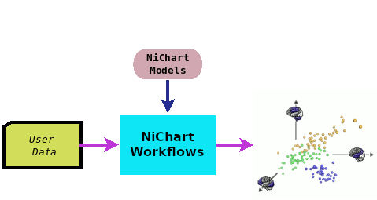

# **NiChart<sup>Workflows</sup>** 

A toolkit that allows users to apply **NiChart** processing methods and pre-trained models on their data.  **NiChart<sup>Workflows</sup>** includes tools for [image processing](https://neuroimagingchart.com/components/#Image%20Processing), [data harmonization](https://neuroimagingchart.com/components/#Harmonization) and [machine learning](https://neuroimagingchart.com/components/#Machine%20Learning), using pre-trained models and reference distributions provided by [**NiChart<sup>Engine</sup>**](https://github.com/gurayerus/NiChart_Engine). **NiChart<sup>Workflow</sup>** utilizes [Snakemake](https://snakemake.github.io) workflows to define multi-step image processing and data analytics pipelines.



## Installation:

Install dependencies for the **NiChart<sup>Workflows</sup>** in a conda environment using the following commands. **NiChart<sup>Workflows</sup>** uses snakemake to automate things, which is (most easily) installed with mamba.

```bash
conda install -n base -c conda-forge mamba # If needed
mamba init # If first time installing, then potentially source ~/.bashrc
mamba create -c conda-forge -c bioconda -n NiChart_Workflows python=3.8 
mamba activate NiChart_Workflows
pip install spare-scores NiChartHarmonize
mamba install -c conda-forge -c bioconda snakemake
```

## Usage:

Users can apply NiChart workflows to their data with a few simple steps:

***1. Copy Data:*** Transfer your data to the designated location within the project directory.

***2. Edit Configuration File:*** Make any necessary adjustments to the configuration file as specified by the package documentation.

***3. Run Workflow:*** Execute the Snakemake workflow to initiate the analysis.

***! For successful workflow execution, user data should meet specific requirements:***

- Input scans should be copied to a folder named:
  
  > "data/{study name}/Images"
  
  where {study name} is a variable for the dataset or study.
  
  Users can create multiple "data/{study name}" folders. Each dataset or study is processed independently, with results saved in sub-folders of the study folder.
  
- A list named:
  
  > "data/{study name}/Lists/{study name}_Demog.csv"
  
  with demographic information for each subject. The list should include the columns
  
    * **MRID**: ID of each scan
    * **Age**: Age of the subject
    * **Sex**: Sex of the subject (M/F)

## Examples:

We provided data for a toy dataset "data/Study1" as an example. Please use it as a reference for your input data. You can apply the structural MRI workflow on this dataset as follows:

```console
cd workflows/w_sMRI
snakemake -np           ## Dry run
snakemake --cores 1     ## Run the pipeline on the Study1
```
If the workflow works successfully, results will be created inside the study folder, e.g.:

> "data/Study1/output",

## Contributing:

We welcome contributions from the community! If you have bug fixes, improvements, or new features, please consider creating a pull request. Before submitting a pull request, please:

- Ensure your code adheres to the existing code style and formatting.
- Include clear documentation for your changes.
- Write unit tests for any new functionality.

## License:

This project is licensed under the [License Name] license. Please refer to the LICENSE file for the full license text. (Replace [License Name] with the actual license used by your project, such as MIT, Apache, or BSD)


## Contact:

For any inquiries, please contact guray.erus@pennmedicine.upenn.edu. (Last Updated: 5/24/2024)

